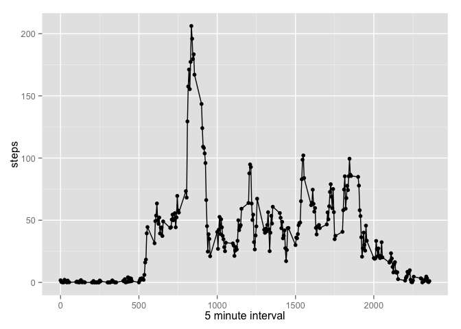
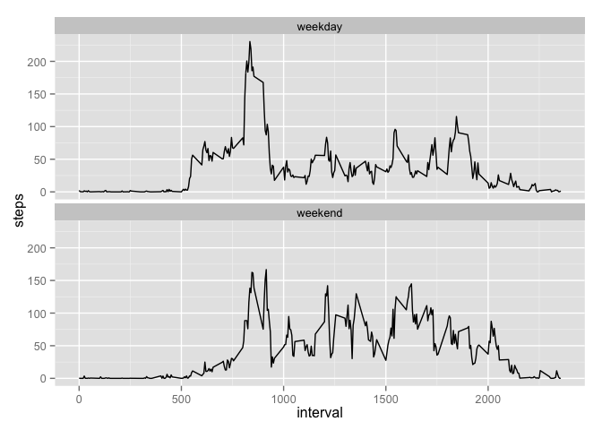

# Reproducible Research: Peer Assessment 1


## Loading and preprocessing the data
Load Data

```r
activity <- read.csv("activity.csv")
```
Set date column as Date

```r
activity$date <- as.Date(activity$date)
```
Create a dataset with omitted NAs

```r
activity.cl <- na.omit(activity)
```
Load necessary libraries

```r
library(plyr)
library(ggplot2)
```

## What is mean total number of steps taken per day?
Calculate total number of steps taken per day

```r
steps.by.day <- ddply(activity.cl,.(date),summarize,steps = sum(steps))
```
Histogram of steps-by-day

```r
qplot(steps, data=steps.by.day)
```

```
## stat_bin: binwidth defaulted to range/30. Use 'binwidth = x' to adjust this.
```

 

Mean steps per day:

```r
mean(steps.by.day$steps)
```

```
## [1] 10766.19
```

Median steps per day:

```r
median(steps.by.day$steps)
```

```
## [1] 10765
```

## What is the average daily activity pattern?

```r
steps.by.interval <- ddply(activity.cl,.(interval),summarize,steps=mean(steps))
```

Plot time series of steps by interval

```r
qplot(interval,steps,type='l',data=steps.by.interval) + xlab("5 minute interval") + geom_line()
```

 

5 minute interval that contains the maximum number of steps:

```r
steps.by.interval[max(steps.by.interval$steps)==steps.by.interval$steps,1]
```

```
## [1] 835
```

## Imputing missing values
Strategy for imputed dataset: The NAs will be replaced by the average number of steps for a given interval
Generate NA dataset

```r
steps.na <- activity[is.na(activity$steps),]
```
Total number of missing values:

```r
nrow(steps.na)
```

```
## [1] 2304
```
Generate imputed dataset

```r
merged.df <- merge(activity,steps.by.interval,by = "interval")
merged.df$steps.x <- ifelse(is.na(merged.df$steps.x),merged.df$steps.y,merged.df$steps.x)
names(merged.df)[2] <- "steps" 
activity.imp <- merged.df
```
Generate summary data for steps by day for the imputed data

```r
steps.by.day.imp <- ddply(activity.imp,.(date),summarize,steps = sum(steps))
```

Plot a histogram of steps-by-day for the imputed data

```r
qplot(steps,data=steps.by.day.imp)
```

```
## stat_bin: binwidth defaulted to range/30. Use 'binwidth = x' to adjust this.
```

 

Mean steps-by-day for the imputed data

```r
mean(steps.by.day.imp$steps)
```

```
## [1] 10766.19
```
Median steps-by-day for the imputed data

```r
median(steps.by.day.imp$steps)
```

```
## [1] 10766.19
```

## Are there differences in activity patterns between weekdays and weekends?
Add a daytype (weekend, weekday) field to dataset

```r
activity.imp$daytype <- ifelse(weekdays(activity.imp$date) %in% c("Saturday","Sunday"),"weekend","weekday")  
```
Generate summary data

```r
steps.by.interval.day <- ddply(activity.imp,.(interval,daytype),summarize,steps=mean(steps))
```

Generate plot of activity by weekend or weekday

```r
qplot(interval,steps,type='l',data = steps.by.interval.day,facets=.~daytype, geom = "blank") + facet_wrap(~daytype,ncol=1) + geom_line()
```

 
